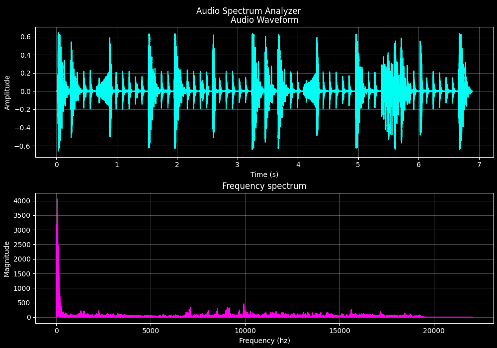

# Audio Spectrum Analyzer

A simple Python tool that visualizes audio files in both time and frequency domains using FFT analysis.

## Features
- Loads `.wav` audio files
- Displays time domain waveform
- Shows frequency spectrum using Fast Fourier Transform
- Professional dark theme visualization

## Requirements
```
numpy
matplotlib
scipy
```

## Usage
```bash
python main.py
```
Enter the path to your `.wav` file when prompted.

## Output
Creates a dual-plot visualization:
- **Top plot:** Audio waveform (amplitude vs time)
- **Bottom plot:** Frequency spectrum (magnitude vs frequency)

## Example


---
Built with Python • NumPy • Matplotlib • SciPy
